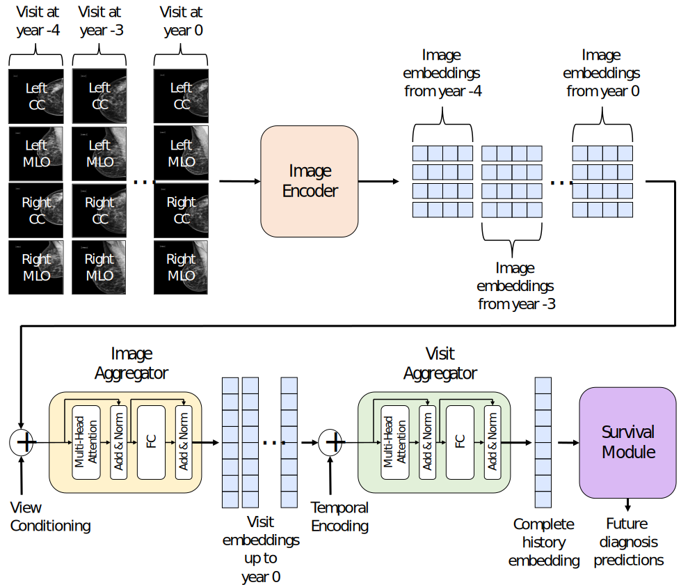

This repository is released under an **Academic Research-Only License** (**no commercial use, no redistribution, no patent license**).

# LoMaR (Longitudinal Mammogram Risk Prediction)
<!-- ##  -->



Python implementation of **LoMaR**. 

---

# Citation

If you use this code in your research, please cite:

> Karaman, Batuhan K., et al. **“Longitudinal Mammogram Risk Prediction.”** *Lecture Notes in Computer Science*, 2024, pp. 437–446. https://doi.org/10.1007/978-3-031-72086-4_41

---

# Abstract

Breast cancer is one of the leading causes of mortality among women worldwide. Early detection and risk assessment play a crucial role in improving survival rates. Therefore, annual or biennial mammograms are often recommended for screening in high-risk groups. Mammograms are typically interpreted by expert radiologists based on the Breast Imaging Reporting and Data System (BI-RADS), which provides a uniform way to describe findings and categorizes them to indicate the level of concern for breast cancer. Recently, machine learning (ML) and computational approaches have been developed to automate and improve the interpretation of mammograms. However, both BI-RADS and ML-based methods focus on the analysis of data from the present and sometimes the most recent prior visit. While it is clear that temporal changes in image features of the longitudinal scans should carry value for quantifying breast cancer risk, no prior work has conducted a systematic study of this.

In this paper, we extend a state-of-the-art ML model to ingest an arbitrary number of longitudinal mammograms and predict future breast cancer risk. On a large-scale dataset, we demonstrate that our model, **LoMaR**, achieves state-of-the-art performance when presented with only the present mammogram. Furthermore, we use LoMaR to characterize the predictive value of prior visits. Our results show that longer histories (e.g., up to four prior annual mammograms) can significantly boost the accuracy of predicting future breast cancer risk, particularly beyond the short-term.

---

# Demo Overview

This repository includes a demonstration of LoMaR inference. We encourage researchers to evaluate our models on their own data and share results as benchmarks.

Below, we provide an overview of the demo dataset structure and how to run the demo. Each file in the repository is intended to be well-commented and self-explanatory.

---

# Data

In `demo/data/`, the file `demo_metadata.csv` contains **100 randomly chosen and properly anonymized subjects**. Each row corresponds to a **different subject**, so we do **not** perform pseudo-test-set based evaluation in this demo. If you want to use a subject more than once in evaluation (e.g., choosing different present points in their history), you should index your data carefully and ensure that **each subject appears only once within a single pseudo-test split**; otherwise, evaluation may be biased. Please refer to the paper for more details.

In `demo/data/demo_metadata.csv`, columns starting with `npy_` contain file paths to **visit embeddings**. These embeddings are obtained via a pretrained image encoder + image aggregator. For generating embeddings, you can use the Mirai codebase:

- https://github.com/yala/Mirai

LoMaR uses **only mammogram embeddings** (no additional risk factors). Make sure your visit embeddings have **dimension 512**. For the demo, we also include example `.npy` files under `demo/data/npy_files/`.

Columns starting with `dx_` in `demo/data/demo_metadata.csv` represent the **future diagnosis** labels (e.g., per follow-up horizon).

---

# Running the demo

You can run the demo with:

```python
from demo.config import *
from demo.demo import *

config = get_example_config()
demo(config)
```

We strongly encourage researchers to read through the repository files to understand the data format and evaluation setup. If you have questions, feel free to reach out at batuhankmkaraman@gmail.com.

# Trained Model Weights
Trained model weights for LoMaR are available upon request due to large file sizes. Please contact Batuhan Karaman (batuhankmkaraman@gmail.com) to obtain the weight files.
